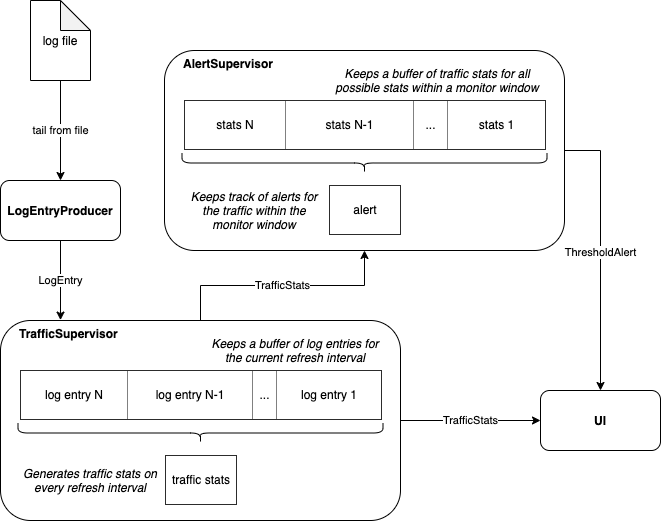

# Access log monitor

Author: Juan Luis Jimenez

## Requirements

Docker Engine 18.06.0+

## How to run the monitor

The monitor has been developed and tested on a Linux environment.
In order to facilitate the distribution, a Docker environment with Go installed is provided.
Following are the commands required to build and run the monitor:
```
# Build a docker image with the log monitor installed
$ make build
# Run a docker container for the built image - enter in an interactive terminal.
$ make bash
# Once inside the Docker container, run the log monitor:
root@d1a9bae2b407:/code# ./bin/logmon
```

The monitor's GUI occupies the whole terminal.
Use `Ctrl+C` or `Q` to exit.

### Configuration options of the log monitor

```
root@d1a9bae2b407:/code# ./bin/logmon -h
Usage: ./bin/logmon [OPTIONS]

OPTIONS:
  -refresh int
    	refresh interval at which traffic stats are computed, in seconds (default 10)
  -source string
    	log file path to monitor (default "/tmp/access.log")
  -threshold int
    	alert condition, in requests per second (default 10)
  -window int
    	time period to check the alert condition, in seconds (default 120)
```

### How to use the provided generator of log entries

A generator of log entries (github.com/mingrammer/flog) is provided along with the log monitor to facilitate testing.
Here's one way to use it within the same terminal session:
```
# Run the log generator in background:
$ make bash
root@d1a9bae2b407:/code# flog -n 1 -l -d 1 >> /tmp/access.log &
# Run the log monitor:
root@d1a9bae2b407:/code# ./bin/logmon -refresh 5
```

## How to run the tests

All provided tests can be run in a Go-ready environment:
```
$ make go-test
```

## Technical decisions

This project contains the following main components:

### LogEntryProducer

It setups a file watch to tail the changes of the log file.
On every new line in the file, it produces and exposes a LogEntry type.

### TrafficSupervisor

It consumes LogEntry types and stores them in a buffer for the current refresh interval.
At the end of every refresh interval, it produces and exposes a TrafficStats type based on the collected LogEntry types.

### AlertSupervisor

It consumes TrafficStats types and stores them in a buffer with enough capacity to store all the possible stats within a monitor window.

On every new TrafficStats consumed, it tracks the alert conditions and produces an alert if needed.

### UI

The monitor has a GUI for the terminal.
It consumes TrafficStats and ThresholdAlert types. It updates the interface every time it receives a new type. 

### High-level diagram



### Main third party libraries used in this project:

- Tail implemented with github.com/nxadm/tail
- Fake log generator: github.com/mingrammer/flog 

## Things to improve
- The monitor only considers one type of alert. Extend it with different alert types.
- Support multiple log formats.
- Support inputs from not only files in disk, for instance, network inputs.
- Add more details to the UI: current req/s, the path of the monitored file, etc.
- This monitor only works for a single file in a single machine. 
 - Evolve the architecture to notify traffic stats from multiple nodes into an alert service.
